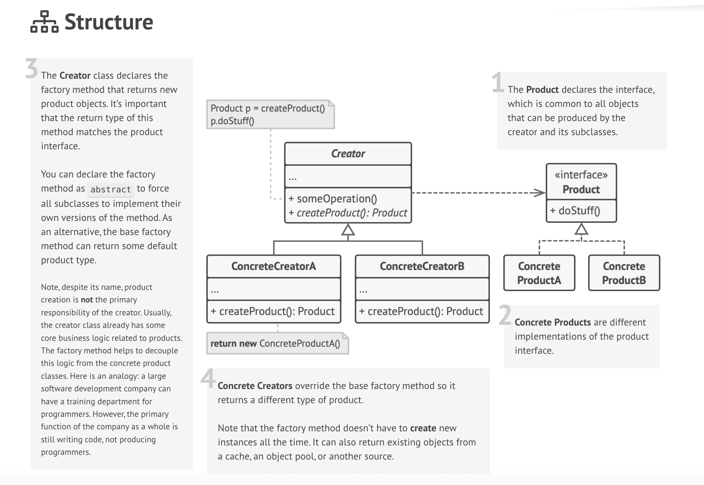
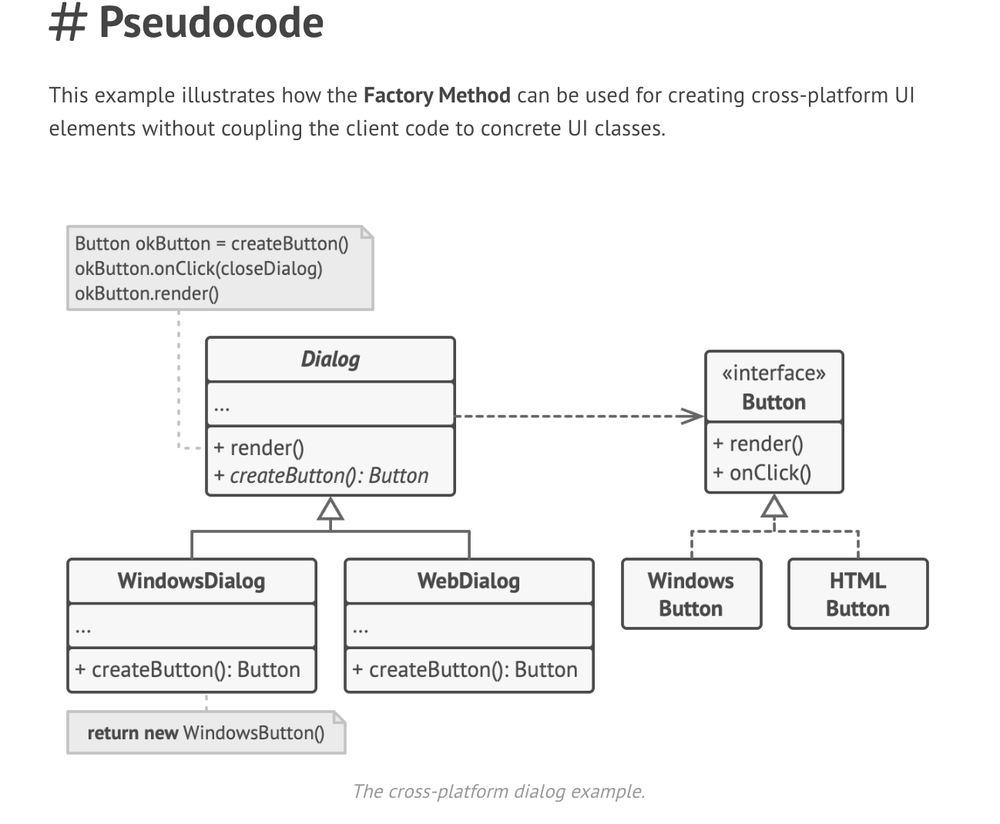

### Introduction

Factory pattern is used to create different objects from a single interface which have common operations in name
but are having seperate implementations to those common operations.

This means we are delegating instantiation of objects to sub classes(*factories*) of a super class which implements a common interface which registers actions related to all the sub classes.

### Structure

### Example

For example, you are creating different renderers for PDF, HTML, docx to show the respective documents in your application. Following implementation will be used in factory pattern.

- **Product Interface(Methods)**:
    - ***Renderer***
        - render(content: string | file buffer): Method used to render the document of format provided.
        - createRenderer(destination: string): Method to create document logic and initialise renderer for provided format.

- **Concrete Product Classes(Classes)**:
    - PDFRenderer implements Renderer: Used for rendering pdf pages.
    - HTMLRenderer implements Renderer: Used for rendering html pages.

- **Creator Class(Methods)**: Class/Abstract class containing method to create product objects.
    - ***DocumentViewerFactory***
        - abstract createRenderer(destination: string): Renderer - abstract method implemented by concrete sub classes which returns object of product interface that can be used to perform render operation.
        
        - render(destination: string, content: string |. file buffer): Common method used to render the specified format renderer.
         

        > This creator class not only consists logic for creating product objects but also contains some core business logic of the product object like render method above which can be overriden and implemented by sub classes of this product object.

- **Concrete creator classes extends Creator class**: Used for creating own instantiation of document with custom logic.
 
    - PDFDocumentViewer extends DocumentViewer: Used for creating pdf pages and rendering content with it.
    - HTMLDocumentViewer extends DocumentViewer: Used for creating html pages and rendering content with it.

**Note**: Here, if we want to add support for excel viewing, we need to create an ExcelDocumentViewer and ExcelRenderer classes
which will have its own implementation.

### Pseudocode

### Applicability

1. Use factory method when you are using a library or a framework and you want to extend it's components in your application.

### How to implement

1. Create a product interface with the methods that make sense in all the products.

2. Add an empty factory method inside the creator class. The return type of the method should match the common product interface.

3. Replace all the product constructors in creator's code with a single factory method. This method takes **productType** as an argument and calls the respective product constructor to create the product instance. 

> This will be too verbose and unreadable as the products keep increasing. So, we can create seperate subclasses for each product type and implement creation there as below.

4. Make the factory method abstract in the factory class and create factory subclasses for each product. In the product factory sub classes, implement the creation overriding method from base factory class.

### Pros and Cons:

- Pros:
    - You avoid tight coupling between the creator and the concrete products.
    - *Single Responsibility Principle*: You can move the product creation code into one place in the program, making the code easier to support.
    - *Open/Closed Principle*: You can introduce new types of products into the program without breaking existing client code.

- Cons:
    - The code may become more complicated since you need to introduce a lot of new subclasses to implement the pattern. The best case scenario is when you’re introducing the pattern into an existing hierarchy of creator classes.

### Testing
Testcases are written for success cases.

1. Using npm start command - `npm run start -- factory <type = pdf | html | all> <destination> <content>`.

Example: `npm run start factory pdf all_manga onepiece_jjk_naruto`

2. Run tests - `npm run test`.

    
