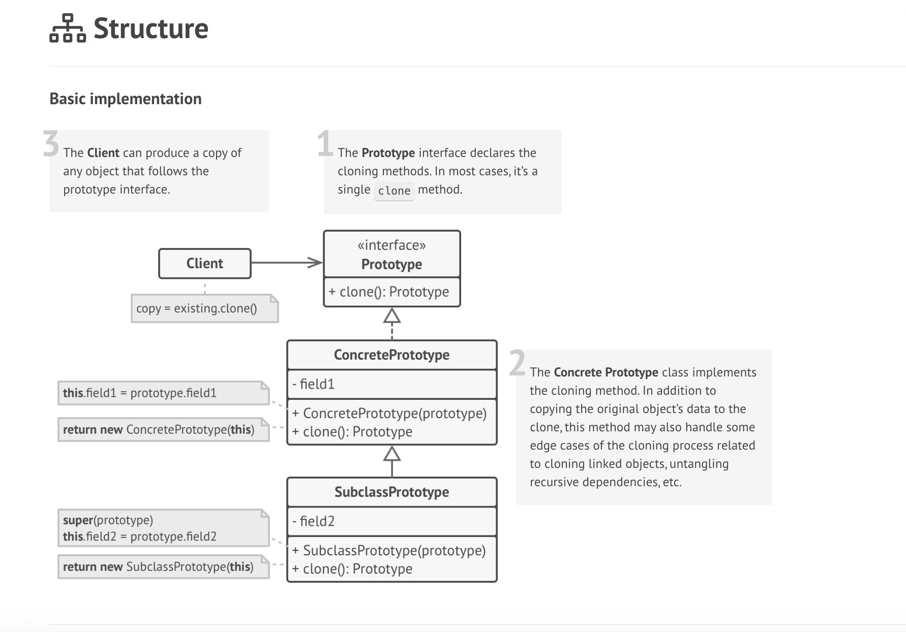
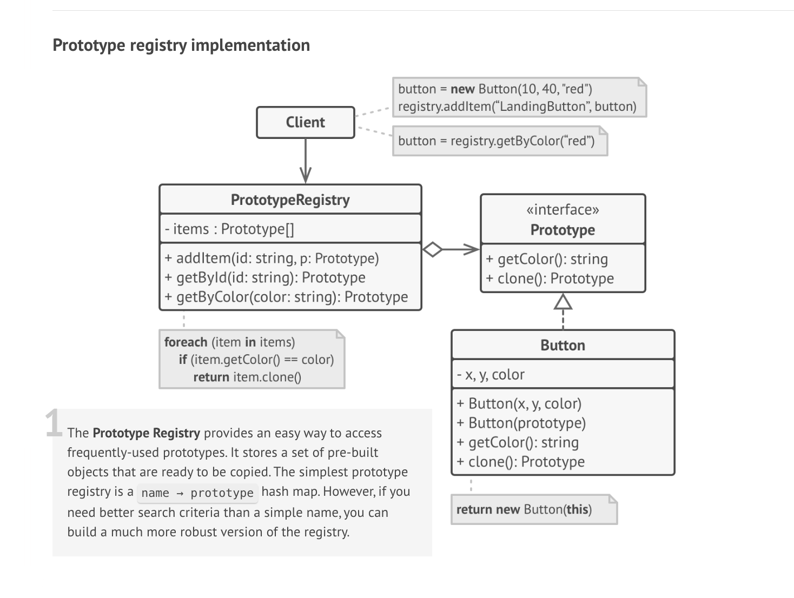

### Introduction

Prototype pattern is used for copying an object's properties into another object(cloning) without making the copying dependent on the class related to the object.

This is useful in cases when we need to create copies of complex objects containing many properties.

### Structure

### Implementation

- #### Example 1:
    For example, you are creating a whiteboard tool which has many kinds of shapes like rectangle, circle, arrow etc. 

    This whiteboard application also enables user to clone existing shapes and work on them as well.
     

    - **Shape Interface/Abstract class:**
        This interface has basic coordinates of the shape to be drawn on whiteboard and a **clone** method.
        - **Properties**:
            - x,y
            - color
        - **Constructor**:
            - Shape()
            - Shape(source: Shape)
        - **Methods**:
            - clone(): Shape - this can be an abstract method which will be implemented in concrete classes like Rectangle, Circle etc.

    - **Rectangle class:**
        This is a concrete implementation of shape abstract class.
        - **Properties**:
            - length
            - breadth
        - **Constructor**:
            - Rectangle(source: Rectangle)
        - **Methods**:
            - clone(): Rectangle - This method calls the copy constructor above which in turn calls **super(source)** to copy private fields x,y,color and also copies length, breadth from rectangle.

- #### Example 2:

    This pattern would be useful in places where we need copying features like in a whiteboard where we create different
    kind of shapes like rectangles, square, arrows etc.

    [Creating copies of different documents in a document management system](https://medium.com/@CodeWithTech/efficient-object-creation-using-the-prototype-pattern-with-real-world-examples-ba87082befba)

### Prototype Registry

We can create a registry of specific prototype objects beforehand if we know we will be going to use them. This is basically like caching commonly used cloned objects(prototypes) beforehand.

### Structure of Prototype registry

