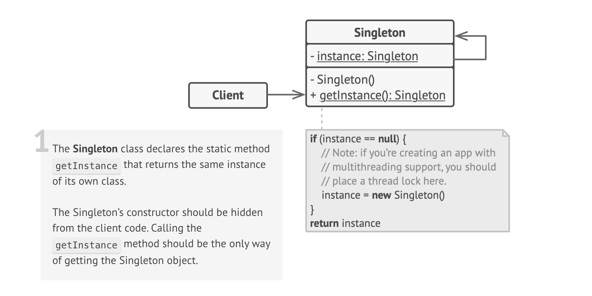

### Introduction

Singleton is a creational design pattern that lets you ensure that a class has only one instance, while providing a global access point to this instance.

This is particularly useful in cases where we want to use same object for multiple class instances - in database connections etc.

**Note**: Singleton pattern violated Single Responsibility principle as it solves two problems at once:

1. Ensure that a class has just a single instance - In case of a single shared resource, this thinking will be hepful. 
2. Provide a global access point to that instance - Global variables can be overwritten by another part of the application but using singleton causes other parts of the application to use single variable for all instances thereby eliminating the threat.

### Implementation

All implementations of the Singleton have these two steps in common:

1. Make the default constructor private, to prevent other objects from using the new operator with the Singleton class.

2. Create a static creation method that acts as a constructor. Under the hood, this method calls the private constructor to create an object and saves it in a static field. All following calls to this method return the cached object.

**Note**: If your code has access to the Singleton class, then it’s able to call the Singleton’s static method. So whenever that method is called, the same object is always returned.

### Testing

1. Using npm start command - `npm run start -- singleton`.

2. Run tests - `npm run test`.

### Structure

### Usage:

1. Use the Singleton pattern when you need stricter control over global variables.

2. Unlike global variables, the Singleton pattern guarantees that there’s just one instance of a class. Nothing, except for the Singleton class itself, can replace the cached instance.

**Note** that you can always adjust this limitation and allow creating any number of Singleton instances. The only piece of code that needs changing is the body of the getInstance method.

